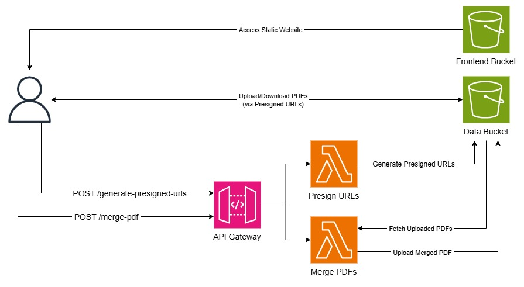

# Serverless-PDF-Merger
A fully serverless web application for merging PDF files.

### Highlights
- Merge multiple PDFs in the browser
- Frontend served via S3 Static Website Hosting
- Backend uses API Gateway + Lambda + S3
- S3 lifecycle rule auto-deletes uploaded and merged PDFs after 2 days
- **Near-zero cost when idle!**

### Architecture

